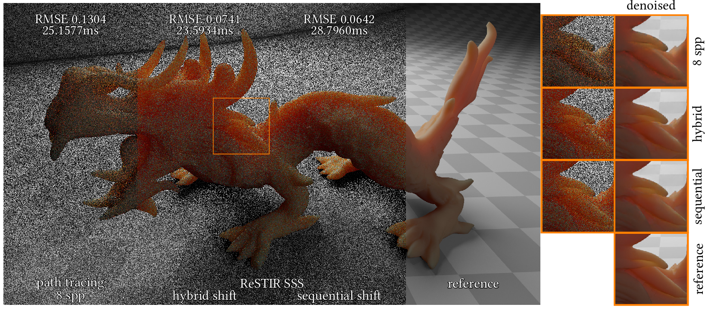
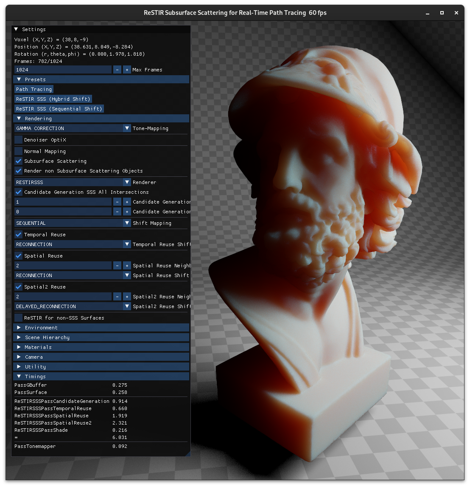

# ReSTIR Subsurface Scattering for Real-Time Path Tracing (ReSTIR SSS)


## Introduction
This repository contains the source code for the HPG 2024 paper:

> [**ReSTIR Subsurface Scattering for Real-Time Path Tracing**](https://doi.org/10.1145/3675372)<br>
> [Mirco Werner](https://github.com/MircoWerner), [Vincent Schüßler](https://cg.ivd.kit.edu/schuessler/staff_index.php), and [Carsten Dachsbacher](https://cg.ivd.kit.edu/dachsbacher/staff_index.php)

> *Abstract* Subsurface scattering is an important visual cue and in real-time rendering it is often approximated using screen-space algorithms. Path tracing with the diffusion approximation can easily overcome the limitations of these algorithms, but increases image noise. We improve its efficiency by applying reservoir-based spatio-temporal importance resampling (ReSTIR) to subsurface light transport paths. For this, we adopt BSSRDF importance sampling for generating candidates. Further, spatiotemporal reuse requires shifting paths between domains. We observe that different image regions benefit most from either reconnecting through the translucent object (reconnection shift), or one vertex later (delayed reconnection shift). We first introduce a local subsurface scattering specific criterion for a hybrid shift that deterministically selects one of the two shifts for a path. Due to the locality, it cannot always choose the most efficient shift, e.g. near shadow boundaries. Therefore, we additionally propose a novel sequential shift to combine multiple shift mappings: We execute subsequent resampling passes, each one using a different shift, which does not require to deterministically choose a shift for a path. Instead, resampling can pick the most successful shift implicitly. Our method achieves real-time performance and significantly reduces noise and denoising artifacts in regions with visible subsurface scattering compared to standard path tracing with equal render time.

## Structure of the Repository
[`ReSTIRSSS/resources/shaders/main/`](./ReSTIRSSS/resources/shaders/main) contains the GLSL shaders for ReSTIR SSS.
- ReSTIR SSS passes: [`restirsss_pass_candidate_generation`](./ReSTIRSSS/resources/shaders/main/passes/restirsss_pass_candidate_generation.comp), [`restirsss_pass_temporal_reuse`](./ReSTIRSSS/resources/shaders/main/passes/restirsss_pass_temporal_reuse.comp), [`restirsss_pass_spatial_reuse`](./ReSTIRSSS/resources/shaders/main/passes/restirsss_pass_spatial_reuse.comp), and [`restirsss_pass_shade`](./ReSTIRSSS/resources/shaders/main/passes/restirsss_pass_shade.comp)
- ReSTIR SSS reservoir: [`restirsss_reservoir`](./ReSTIRSSS/resources/shaders/main/restirsss/restirsss_reservoir.glsl)
- ReSTIR SSS target function: [`restirsss_target_function`](./ReSTIRSSS/resources/shaders/main/restirsss/restirsss_target_function.glsl)
- ReSTIR SSS shifts (reconnection, delayed reconnection, hybrid, sequential) and their Jacobians: [`restirsss_shift`](./ReSTIRSSS/resources/shaders/main/restirsss/restirsss_shift.glsl)
- MIS weights (generalized balance heuristic, streaming pairwise MIS): [`restirsss_mis`](./ReSTIRSSS/resources/shaders/main/restirsss/restirsss_mis.glsl)

Our sequential shift strategy uses *probabilistic inversion* to draw new random numbers before applying random replay when shifting a path with delayed reconnection (see paper Sec. 4.3 for details). 
We also demonstrate the possibility to use probabilistic inversion in ReSTIR in general to use both path and primary sample space shifts for a certain sample by implementing it in a surface reflection case with a path of length 3 (see supplemental document Sec. 3 for details).
This demonstration can be enabled in [`restirsss_defines`](./ReSTIRSSS/resources/shaders/main/restirsss/restirsss_defines.glsl) using the `RESTIRSSS_PROBINVERSETEST_L3PATH` macro.
Also see [`probinversetest`](./ReSTIRSSS/resources/shaders/main/restirsss/probinversetest).

## Requirements
- Vulkan 1.3
- GPU with ray tracing support
- (optional) [OptiX](https://developer.nvidia.com/designworks/optix/download) 8.0.0 or higher and [CUDA Toolkit](https://developer.nvidia.com/cuda-downloads) for [denoising](https://developer.nvidia.com/optix-denoiser)

Other dependencies are included as submodules in [`VkRaven/lib/`](./VkRaven/lib).

## Running the Code
Tested on Linux with GCC 14.1.1 and NVIDIA RTX 3070 GPU.

Windows is not officially supported, however, we get it to run using MinGW and disabling OptiX support in the [CMake configuration](./ReSTIRSSS/CMakeLists.txt).

### Clone and Build
```bash
git clone --recursive git@github.com:MircoWerner/ReSTIR-SSS.git
cd ReSTIR-SSS/ReSTIRSSS
mkdir build
cd build
cmake ..
make
```
### Download Assets
See [ReSTIR SSS Assets](https://github.com/MircoWerner/ReSTIR-SSS-Assets) repository for more details.
```bash
cd ReSTIR-SSS/ReSTIRSSS/resources
git clone git@github.com:MircoWerner/ReSTIR-SSS-Assets.git assets
cd assets/asiandragon
tar -xf dragon.tar.xz # unpack large file
```
### Run
```bash
cd ReSTIR-SSS/ReSTIRSSS/build
./restirsss ajax
```
- The provided scenes can be found in [`ReSTIRSSS/resources/scenes/`](./ReSTIRSSS/resources/scenes): `ajax`, `ajaxmanylights`, `asiandragon`, `lteorb`, `flattest`.
- Use `--preset ...` to select the initial rendering mode. This can also be changed during runtime in the UI.
- Use `--evaluate ...` to start the automatic evaluation to generate renderings (to measure errors) or timings as shown in the paper. The video option generates the frames for our short video.
```
Usage: restirsss [--help] [--version] [--preset VAR] [--evaluate VAR] scene

Positional arguments:
  scene          name of the scene (in resources/scenes/<name>.xml) [required]

Optional arguments:
  -h, --help     shows help message and exits 
  -v, --version  prints version information and exits 
  --preset       pathtracing, hybrid, sequential [default: "hybrid"]
  --evaluate     renderings, timing, video 
```

### Controls
- `WASD` to move the camera
- `Space` or `E` to move the camera up
- `Shift` or `Q` to move the camera down
- Hold `Ctrl` to move faster
- Hold `Right Mouse Button` to look around
- `Esc` to close the application

## Acknowledgements
We would like to thank the creators and authors of the used assets and libraries:
- Ajax Bust by Jotero, [Asian Dragon](http://graphics.stanford.edu/data/3Dscanrep/) by XYZ RGB Inc, and [LTE Orb](https://github.com/lighttransport/lighttransportequation-orb) by Yasutoshi Mori (@MirageYM).
- [argsparse](https://github.com/p-ranav/argparse), [glfw](https://github.com/glfw/glfw), [glm](https://github.com/g-truc/glm), [imgui](https://github.com/ocornut/imgui), [pugixml](https://github.com/zeux/pugixml), [SPIRV-Reflect](https://github.com/KhronosGroup/SPIRV-Reflect), [stb](https://github.com/nothings/stb), [tinygltf](https://github.com/syoyo/tinygltf), [tinyobjloader](https://github.com/tinyobjloader/tinyobjloader), and [OptiX](https://developer.nvidia.com/optix-denoiser).

